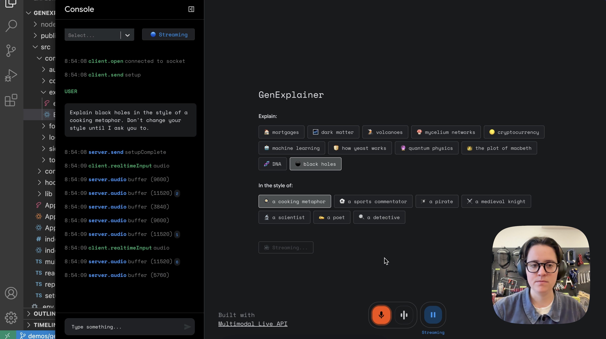

# Multimodal Live API - Web console

This repository contains a react-based starter app for using the [Multimodal Live API](<[https://ai.google.dev/gemini-api](https://ai.google.dev/api/multimodal-live)>) over a websocket. It provides modules for streaming audio playback, recording user media such as from a microphone, webcam or screen capture as well as a unified log view to aid in development of your application.

[](https://www.youtube.com/watch?v=gbObKqfqdlM)

Watch the demo of the Multimodal Live API [here](https://www.youtube.com/watch?v=gbObKqfqdlM).

---
We have provided several example applications on branches of this repository:

To get started, [create a free Gemini API key](https://aistudio.google.com/apikey). We have provided several example applications on other branches of this repository:

- [demos/GenExplainer](https://github.com/google-gemini/multimodal-live-api-web-console/tree/demos/genexplainer)
- [demos/GenWeather](https://github.com/google-gemini/multimodal-live-api-web-console/tree/demos/genweather)
- [demos/GenList](https://github.com/google-gemini/multimodal-live-api-web-console/tree/demos/genlist)

## GenList

In this demo we're exploring generative UI: speak to an agent that can generate interfaces for you, in real time. In this example, the agent can create and edit checklists.

We built this behaviour with a simple set of tools available to the agent, defined in [GenList.ts](/src/components/genlist/GenList.tsx):

```typescript
// Tools
const toolObject: Tool[] = [
  {
    functionDeclarations: [
      {
        name: "look_at_lists",
        description:
          "Returns all current lists. Called immediately before calling `edit_list`, to ensure latest version is being edited.",
      },
      {
        name: "edit_list",
        description:
          "Edits list with specified id. Requires `id`, `heading`, and `list_array`. You must provide the complete new list array. May be called multiple times, once for each list requiring edit.",
        parameters: {
          type: SchemaType.OBJECT,
          properties: {
            id: {
              type: SchemaType.STRING,
            },
            heading: {
              type: SchemaType.STRING,
            },
            list_array: {
              type: SchemaType.ARRAY,
              items: {
                type: SchemaType.STRING,
              },
            },
          },
          required: ["id", "heading", "list_array"],
        },
      },
      {
        name: "remove_list",
        description:
          "Removes the list with specified id. Requires `id`. May be called multiple times, once for each list you want to remove.",
        parameters: {
          type: SchemaType.OBJECT,
          properties: {
            id: {
              type: SchemaType.STRING,
            },
          },
          required: ["id"],
        },
      },
      {
        name: "create_list",
        description:
          "Creates new list. Requires `id`, `heading`, and `list_array`. May be called multiple times, once for each list you want to create.",
        parameters: {
          type: SchemaType.OBJECT,
          properties: {
            id: {
              type: SchemaType.STRING,
            },
            heading: {
              type: SchemaType.STRING,
            },
            list_array: {
              type: SchemaType.ARRAY,
              items: {
                type: SchemaType.STRING,
              },
            },
          },
          required: ["id", "heading", "list_array"],
        },
      },
    ],
  },
];
```


## Development

This project was bootstrapped with [Create React App](https://github.com/facebook/create-react-app).
Project consists of:

- an Event-emitting websocket-client to ease communication between the websocket and the front-end
- communication layer for processing audio in and out
- a boilerplate view for starting to build your apps and view logs

## Available Scripts

In the project directory, you can run:

### `npm start`

Runs the app in the development mode.\
Open [http://localhost:3000](http://localhost:3000) to view it in the browser.

The page will reload if you make edits.\
You will also see any lint errors in the console.

### `npm run build`

Builds the app for production to the `build` folder.\
It correctly bundles React in production mode and optimizes the build for the best performance.

The build is minified and the filenames include the hashes.\
Your app is ready to be deployed!

See the section about [deployment](https://facebook.github.io/create-react-app/docs/deployment) for more information.

_This is an experiment showcasing the Multimodal Live API, not an official Google product. We’ll do our best to support and maintain this experiment but your mileage may vary. We encourage open sourcing projects as a way of learning from each other. Please respect our and other creators' rights, including copyright and trademark rights when present, when sharing these works and creating derivative work. If you want more info on Google's policy, you can find that [here](https://developers.google.com/terms/site-policies)._
